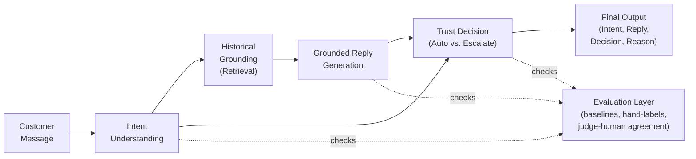

# AmazonHelp Support Agent

A take-home implementation for the Hiver SDE Intern assignment, built on the Kaggle **Customer Support on Twitter** dataset. It reconstructs AmazonHelp customer/support conversation pairs, derives an intent taxonomy from the data itself, classifies incoming messages, drafts replies grounded in historical resolutions, and applies a deterministic auto-handle-vs-escalate policy — with a full evaluation harness to back up (and honestly critique) the results.

## What it does

Given an incoming customer message, the agent returns:
1. **Intent** — classified into a small set of intents derived from the data (not a generic taxonomy)
2. **Draft reply** — grounded in how AmazonHelp has historically resolved similar issues
3. **Decision** — auto-handle or escalate to a human, with a stated reason

## Conceptual architecture

Before looking at which file does what, here's the system at the level of *ideas* — what each stage is responsible for, independent of implementation:



The main flow (solid arrows) is a straightforward pipeline: understand the message, ground a response in what's actually worked before for this brand, generate a reply, and decide whether a human needs to step in. The **Evaluation Layer** (dashed arrows) is deliberately drawn apart from that flow rather than tacked on after it — it isn't a pipeline step, it's the thing that proves the pipeline is trustworthy. It checks Intent Understanding against baselines, checks Reply Generation and the Trust Decision against hand-labeled ground truth, and checks whether its own automated judge agrees with a human before that judge is trusted at all.

## How it works, step by step

**Step 0 — Data preparation (`data_prep.py`).** Before anything else runs, this script loads the raw `twcs.csv` (millions of tweets), filters down to just the customer↔AmazonHelp threads, and reconstructs clean `(customer_message, brand_resolution)` pairs by matching each customer tweet to the brand's reply via `response_tweet_id` / `in_response_to_tweet_id`. It subsamples to ~700 threads and cleans the text (strips @mentions, URLs, dedupes). Everything downstream depends on this running first.

**Step 1 — Intent Understanding (`intent_taxonomy.py`, `classifier.py`).**
- `intent_taxonomy.py` runs once, ahead of time, not per-message. It embeds a sample of cleaned messages locally (no API cost), clusters them with KMeans, then makes **one single batched LLM call** to name the resulting clusters (e.g. "Order Delivery Issue," "Account Access Problem"). Output: `data/intents.json`.
- `classifier.py` runs per incoming message (or batch of messages). Given the taxonomy, it few-shot prompts an LLM to classify each message into one of those intents with a confidence score, batching 10–20 messages per call to conserve rate limits.
- **Output:** `intent + confidence`.

**Step 2 — Historical Grounding (`retrieval.py`).** Entirely local, no LLM call. It embeds every historical `(customer_message, brand_resolution)` pair with `sentence-transformers`, builds a cosine-similarity index, and retrieves the top-k most similar past resolutions for the new message. This is what lets the agent's reply reflect how this specific brand actually solves things, instead of a generic LLM guess.

**Step 3 — Reply Generation (`reply_generator.py`).** Takes the message, its intent, and the retrieved historical resolutions, and makes an LLM call to draft a reply instructed to base its wording/approach on those retrieved examples. This is the "grounded" part — the difference between an LLM improvising a plausible answer and an LLM imitating this brand's proven resolution pattern.

**Step 4 — Trust Decision (`escalation_policy.py`).** Pure logic, zero API calls. Combines the classifier's confidence (Step 1), the risk tier of the intent (e.g. "refund/billing" riskier than "order status"), and any generation uncertainty (Step 3) into an auto-handle-or-escalate decision, plus a plain-text reason — so the decision is auditable, not a black box.

**Step 5 — Final Output (`pipeline.py`).** The orchestrator. Calls Steps 1–4 in sequence for a given input and returns `{intent, confidence, draft_reply, decision, reason}`. Has a CLI (`--input`, `--limit`, `--dry-run`) so you can run it on a single message, a batch file, or a free dry-run with no API calls.

**Running alongside all of it — Evaluation (`baselines.py`, `eval/build_golden_set.py`, `eval/llm_judge.py`, `eval/metrics.py`).**
1. `baselines.py` checks Step 1 — a trivial baseline (always guess the majority intent) and a simple baseline (TF-IDF + Logistic Regression), both with zero API calls, give the LLM classifier something honest to beat.
2. `eval/build_golden_set.py` creates a stratified 150-example sample across the intents, which gets hand-labeled with the true intent — the ground truth everything else is checked against.
3. `eval/llm_judge.py` checks Steps 3 and 4 — scores generated replies on correctness/tone/groundedness and checks escalation appropriateness via a batched LLM call, and computes **agreement between the LLM judge and hand-labels** on a 25–30 example subset, so the judge itself isn't trusted blindly.
4. `eval/metrics.py` pulls it together: classifier accuracy/F1 vs. baselines, reply quality scores, judge-human agreement, escalation precision/recall.

**Cutting across every step — `utils/llm_client.py`.** Every LLM call anywhere in the system (classifier, reply generator, taxonomy naming, judge) goes through this one wrapper: disk caching so reruns don't re-spend budget, retry with exponential backoff on rate limits, a conservative rate limiter, and a running counter of calls/tokens/estimated cost. This is what makes the whole system usable on a rate-limited key instead of burning through it on the first run.

**One command ties it all together:** `run_all.sh` runs the full sequence — `data_prep.py → intent_taxonomy.py → retrieval.py → build_golden_set.py → pipeline.py` — reproducing headline results in under 15 minutes on a warm cache.


## Repo structure

| File | Role |
|---|---|
| `data_prep.py` | Loads `twcs.csv`, filters to AmazonHelp threads, reconstructs `(customer_message, brand_resolution)` pairs, subsamples, cleans |
| `intent_taxonomy.py` | Embeds messages locally, clusters with KMeans, uses **one** batched LLM call to name clusters → `data/intents.json` |
| `classifier.py` | Few-shot LLM intent classifier, batched (10–20 messages per call), cached |
| `baselines.py` | Trivial (majority-class) and simple (TF-IDF + Logistic Regression) baselines — no API calls |
| `retrieval.py` | Local `sentence-transformers` embeddings + cosine similarity index for grounding replies |
| `reply_generator.py` | Generates draft replies grounded in retrieved historical resolutions |
| `escalation_policy.py` | Pure logic — combines classifier confidence + intent risk tier into an auto/escalate decision with a reason |
| `pipeline.py` | End-to-end orchestration; CLI with `--input`, `--limit`, `--dry-run` |
| `utils/llm_client.py` | Single wrapper for all LLM calls — disk caching, `tenacity` retry/backoff, rate limiting, running call/cost counter |
| `eval/build_golden_set.py` | Stratified 150-example golden set for hand-labeling |
| `eval/llm_judge.py` | Batched LLM-as-judge scoring (correctness, tone, groundedness, escalation appropriateness) + judge-human agreement calculation |
| `eval/metrics.py` | Classifier accuracy/F1/confusion matrix vs. baselines, reply quality, escalation precision/recall |
| `run_all.sh` | One-command reproduction of headline results |
| `reports/` | `REPORT.md` — problem framing, results, failure analysis, "what's misleading about my headline number," next steps |
| `DECISION_LOG.md` | Non-obvious engineering decisions and why (brand choice, sample sizes, local-vs-API tradeoffs, etc.) |

## Setup

```bash
python3 -m venv .venv
source .venv/bin/activate
pip install -r requirements.txt
cp .env.example .env
# choose a provider in .env: claude, openai, or ollama
mkdir -p data
# put Kaggle twcs.csv at data/archive/twcs/twcs.csv
```

The first `sentence-transformers` run downloads `all-MiniLM-L6-v2`; every embedding call after that is local, not an API call. Supported LLM providers:

- **Claude** — `LLM_PROVIDER=claude`, `ANTHROPIC_API_KEY` (requires paid credits)
- **OpenAI** — `LLM_PROVIDER=openai`, `OPENAI_API_KEY`
- **Ollama (local, free)** — `LLM_PROVIDER=ollama`, `ollama pull llama3.2:3b` (or set `OLLAMA_MODEL` for a different installed model)

The workspace default is `ollama` since it requires no paid API access. All LLM responses are cached in `.cache/llm`, retried on rate-limit errors, and spaced by a conservative two-second interval — so the first run may be slow, but warm-cache reruns reuse prior responses instead of re-calling the API.

## Reproduction

```bash
./run_all.sh
```

For a no-API smoke test on ten rows:

```bash
LIMIT=10 DRY_RUN=1 ./run_all.sh
printf '%s\n' 'My package is late' 'I need a refund' > /tmp/messages.txt
python3 pipeline.py --input /tmp/messages.txt --limit 2 --dry-run
```

Full pipeline sequence:

```bash
python3 data_prep.py --brand AmazonHelp
python3 intent_taxonomy.py
python3 retrieval.py
python3 eval/build_golden_set.py
python3 pipeline.py --input messages.txt --limit 5
```

After `data/golden_set.csv` is generated, hand-label `true_intent`, then train/evaluate the local baselines. Copy pipeline outputs into an evaluation table with the required ground-truth columns before running `eval/metrics.py`.

## Scope and budget

Default scope is **700 linked threads**, a **150-example golden set**, and a **30-example judge/human agreement subset** — a deliberate scope-down to work within a rate-limited API budget (documented as a reasoned tradeoff in `DECISION_LOG.md` and flagged as a caveat in `reports/REPORT.md`, not hidden).

Approximate API call budget:
- Cold 30-example smoke/eval path: **~27 calls** (1 taxonomy naming + 10 classifier batches for 150 examples + 2 classifier batches for the smoke run + 8 reply batches for 30 examples + 6 judge batches)
- Full 150-example reply evaluation: **~55 calls** (38 reply batches instead of 8)
- Full 700-thread reply generation: **~230 calls** — run only after the smaller evaluation is accepted

Cache hits never call the API. `utils/llm_client.py` prints running call count, cache-hit rate, token counts, and approximate spend after every run.

## Manual inputs still required

This pipeline does not fabricate results — the following steps need a human:

- [ ] Confirm/choose the brand handle
- [ ] Provide `twcs.csv` (Kaggle dataset)
- [ ] Review and rename `data/intents.json` after auto-generation
- [ ] Hand-label the 150-example golden set (`true_intent` column)
- [ ] Fill the 30-row human-labels template (ground truth + quality scores)
- [ ] Complete the TODO-ME sections in `reports/REPORT.md` with real metrics and real examples

## License / Attribution

Built for a take-home technical assignment. Dataset: [Customer Support on Twitter](https://www.kaggle.com/datasets/thoughtvector/customer-support-on-twitter) (Kaggle, thoughtvector).
